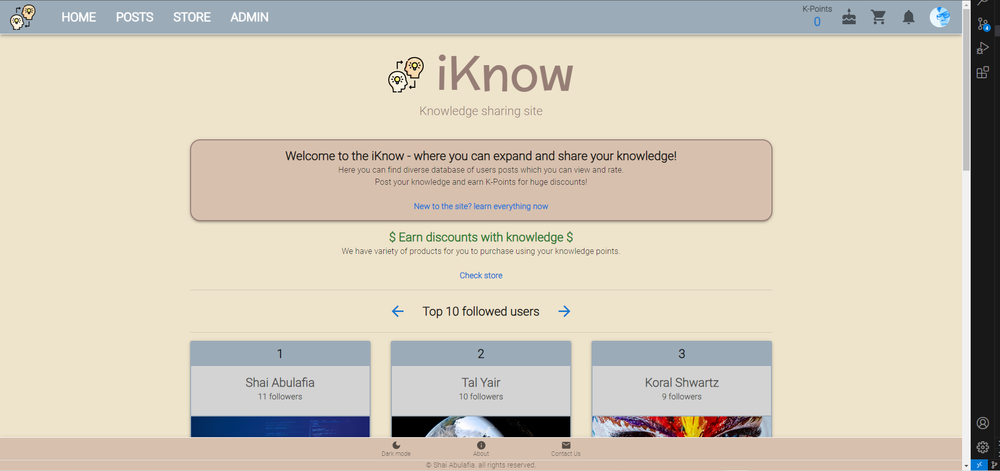

````markdown
# iKnow - Social Media Knowledge Sharing Platform (MERN Project)

iKnow is a social media knowledge sharing platform built using the MERN stack (MongoDB, Express, React, Node.js). It allows users to share and discover valuable insights, ideas, and information on various topics. Whether you're a student, professional, or enthusiast, iKnow provides a platform to connect and learn from others in a collaborative environment.



## Features

- **User Authentication:** Secure user registration and login functionality.
- **Profile Creation:** Users can create and customize their profiles.
- **Post Sharing:** Share posts containing text, images, or links.
- **Comments and Discussion:** Engage in discussions through comments on posts.
- **Rating:** Users can express their opinions on posts and comments.
- **Search Functionality:** Easily find posts and users with the search feature.
- **Categories and Tags:** Organize posts by categories and add relevant tags.
- **Online store:** Shopping cart and checkout process.
- **Orders tracker:** Track your orders and get notifications on update.
- **Admin pannel:** For managing products, orders, and users.
- **Responsive Design:** Access the platform seamlessly on various devices.

## Installation

1. Clone the repository:
   ```sh
   git clone https://github.com/ShaiAbulafia/iKnow-MERN-Project-social-media-knowledge-sharing.git
   cd iKnow-MERN-Project-social-media-knowledge-sharing
   ```
````

2. Install server dependencies:

   ```sh
   cd server
   npm install
   ```

3. Install client dependencies:

   ```sh
   cd ../client
   npm install
   ```

4. Set up environment variables:
   Create a `.env` file in the `server` directory with the following content:

   ```env
   NODE_ENV= '' //development or production
   PORT= 8181
   TOKEN_GENERATOR= jwt
   JWT_KEY=your_jwt_secret // replace your_jwt_secret with your key
   LOGGER= morgan
   DB= MONGODB
   DB_NAME= your_mongoAtlas_username // only in production ENV
   DB_PASSWORD= your_mongoAtlas_password // only in production ENV
   ```

   my .env file will be given on request

5. Start the development server:

   ```sh
   cd ../server
   npm run dev
   ```

6. Start the client:

   ```sh
   cd ../client
   npm start
   ```

7. Open your browser and navigate to `http://localhost:3000` to access iKnow.

## Usage

1. **Registration and Login:** Sign up for an account or log in if you already have one.

2. **Profile Creation:** After logging in, create and personalize your profile with a profile picture and bio.

3. **Exploring Posts:** Browse through posts on various topics shared by other users.

4. **Sharing Knowledge:** Create your own posts by clicking the "New Post" button and providing relevant content.

5. **Engagement:** Engage in discussions by commenting on posts and rating posts and comments.

6. **Search and Discover:** Use the search bar to find specific posts or products based on keywords or tags.

7. **Categories and Tags:** Explore posts and discover content through relevant tags.

8. **Responsive Design:** Enjoy a seamless experience on different devices, including desktops, tablets, and mobile phones.

## Contributing

Contributions are welcome! If you find a bug, have an enhancement in mind, or want to contribute in any way, please follow these steps:

1. Fork the repository.

2. Create a new branch for your feature or bug fix:

   ```sh
   git checkout -b feature/your-feature-name
   ```

3. Make your changes and commit them with descriptive commit messages.

4. Push your changes to your forked repository.

5. Create a pull request to the `main` branch of this repository.

## License

This project is licensed under the MIT License - see the [LICENSE](./LICENSE) file for details.

---

Feel free to contact us at [shaiabulafia12@gmail.com](mailto:shaiabulafia12@gmail.com) for any questions or feedback. We hope you enjoy using iKnow for sharing and gaining knowledge!
